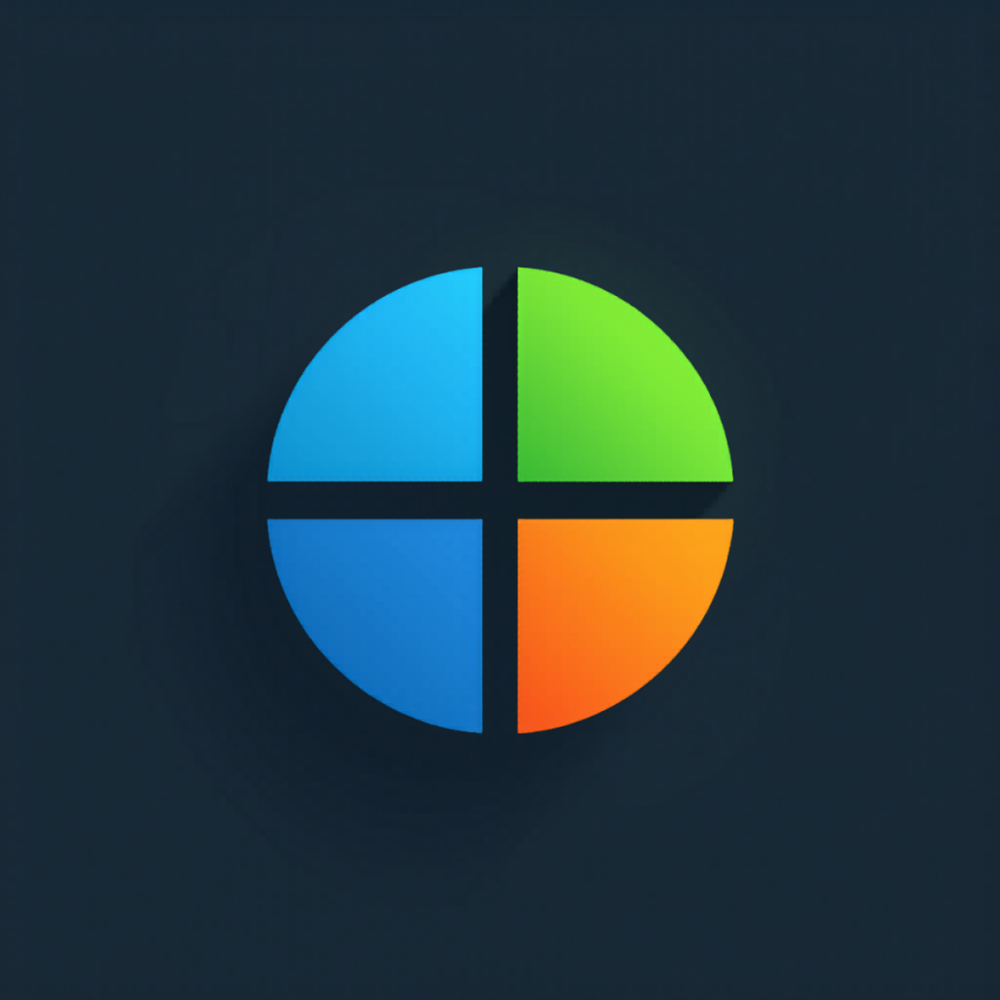

# ➗ Mitap

  

**Dividí gastos con amigos fácil: juntadas, salidas y cuentas compartidas.**

> Mitap te resuelve las cuentas en segundos. Sin registro, sin complicaciones.

---

## 🎯 3 modos para cada situación

### 🏠 Juntada
Cada uno aportó algo distinto (asado, bebidas, postre). Cargá lo que puso cada uno y Mitap calcula quién debe a quién.

### 🍺 Salida
Uno pagó la cuenta del bar o restaurante. Dividí por persona o por lo que consumió cada uno, ítem por ítem.

### ➗ División rápida
Uno pagó, todos ponen lo mismo. En 2 toques tenés el resultado.

---

## 📱 Funciones principales

- Calculadora inteligente que minimiza las transferencias entre amigos
- Creá grupos para dividir gastos recurrentes (el depto, viajes, la oficina), con el balance de todo el grupo
- Gastos en otra moneda con tu tipo de cambio (ideal para viajes)
- Compartí un grupo con un link o un QR
- Historial completo de tus divisiones
- Compartí el resumen por WhatsApp o cualquier app
- Marcá los pagos como realizados para saber quién ya pagó
- Vista swipeable de divisiones dentro de cada grupo
- Modo oscuro incluido
- Balances, estadísticas por categoría y resumen en PDF

---

## 🆓 Todo gratis

Todas las funciones están libres, sin límites: grupos ilimitados, historial completo, balances y estadísticas, multi-moneda, compartir grupos y exportar resumen en PDF.

La versión gratis muestra un anuncio discreto abajo. Nunca mientras cargás nombres o montos.

**⭐ Mitap Pro** saca la publicidad de toda la app. Pago único, sin suscripción, tuyo para siempre.

---

## 🔒 Privacidad

- **Tus gastos no salen de tu teléfono:** grupos, nombres y montos se guardan sólo en tu dispositivo
- Sin cuentas de usuario
- Internet para compras in-app (Google Play Billing) y, en la versión gratis, para los anuncios de Google AdMob
- Con Mitap Pro no se cargan anuncios

📄 [Política de Privacidad completa](PRIVACY_POLICY.md)

---

## 💬 Feedback y soporte

¿Encontraste un bug? ¿Tenés una sugerencia? ¡Abrí un issue!

👉 [Abrir issue](https://github.com/gabriel600r/mitap-feedback/issues/new)

---

## 📬 Contacto

**EgeaINC** — Buenos Aires, Argentina

---

*Hecha con 🧉 en Argentina*
